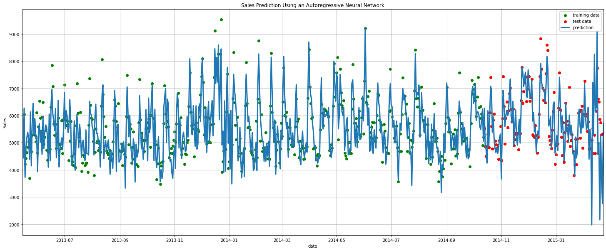
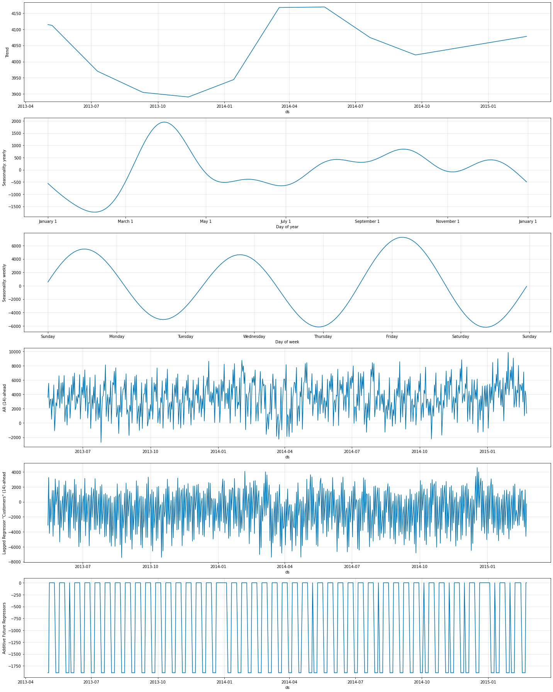

# Predict Future Sales Using Facebook´s Novel Neural Prophet

## Goal of this project
The intention of this project is to test the feasibility of applying the novel and already well known facebook package "neural prophet" to accurately forecast future sales based on historical multivariate time series data. The beauty of this approach is the combination of simple autoregression with a deep neural network while still yielding interpretable forecasts.
## Intuition behind Facebook´s prophet and neural prophet approach
Prophet is a procedure for forecasting time series data based on an additive model where non-linear trends are fit with yearly, weekly, and daily seasonality, plus holiday effects. It works best with time series that have strong seasonal effects and several seasons of historical data. Prophet is robust to missing data and shifts in the trend, and typically handles missing data and outliers well.\
NeuralProphet has a number of added features with respect to original Prophet which are:
- Gradient Descent for optimisation via using PyTorch as the backend
- Modelling autocorrelation of time series using AR-Net
- Modelling lagged regressors using a sepearate feed-forward neural network
- Configurable non-linear deep layers of the FFNNs
- Tuneable to specific forecast horizons (greater than 1).
- Custom losses and metrics

## Modeling Results
The figure below shows the historical sales from 2013 until July 2015 and the 14-day ahead forecast. Apparently, there is a good match beetween the forecast (blue curve) and the actual sales not only for the training period (blue dots) but also for the testing period (red dots).

<table>
  <tr><td>
    
  </td></tr>
    <tr><td align="center">
    <b>Figure 1. Historical sales data and future sales estimates derived by applying the additive regression model developed by facebook. 
  </td></tr>
</table>

Applying facebook-prophet model also gives insight into the trend, the effects of hollidays, the day of the week and the month, as depicted below. Please note that these components affect the sales significantly.

## Model Interpretability
As described above, the neural-prophet model is highly interpretable due to its component-wise additive nature. The figure below show the different model components and their contribution to the predicted sales. As typicall for time series data, the model detects trends and seasonality components. In addition, it shows that the past sales (i.e. lagged sales) also have a strong predictive power for future sales. Last but not least, the promo-component reveals that promotion can potentially increase sales by more than 1750 sales-units.

<table>
  <tr><td>
    
  </td></tr>
  <tr><td align="center">
    <b>Figure 2. Trend and effect sizes for holidays, weekdays and months in units of sales estimated by facebook´s prophet additive regression model. 
  </td></tr>
</table>
