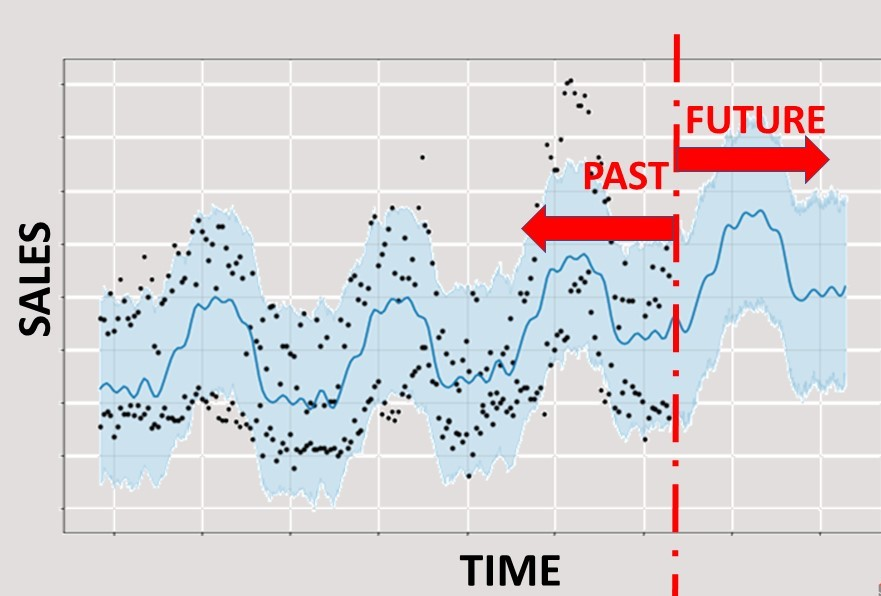

# Predict Future Sales Using Facebook´s Novel Prophet Package

## Goal of this project
The intention of this project is to test the feasibility of applying the novel but already well known facebook package "fbprophet" to forecast future markets sales based on historical multivariate time series data. We will attack this challenge by explicitely using temporal information (i.e. not just simple regression).

## Intuition behind Facebook´s prophet approach
Prophet is a procedure for forecasting time series data based on an additive model where non-linear trends are fit with yearly, weekly, and daily seasonality, plus holiday effects. It works best with time series that have strong seasonal effects and several seasons of historical data. Prophet is robust to missing data and shifts in the trend, and typically handles missing data and outliers well.

<table>
  <tr><td>
    
  </td></tr>
  <tr><td align="center">
    <b>with courtesy of: www.superdatascience.com 
  </td></tr>
</table>

## Results
The figure below shows the historical sales from 2013 until July 2015 and the predicted sales estimates (blue curve) for the months from August until October in 2015. The gray curve represents the confidence bounds (5%-95%) of the sales predictions.

<table>
  <tr><td>
    
  </td></tr>
</table>

Applying facebook-prophet model also gives insight into the trend, the effects of hollidays, the day of the week and the month, as depicted below.

<table>
  <tr><td>
    
  </td></tr>
</table>
